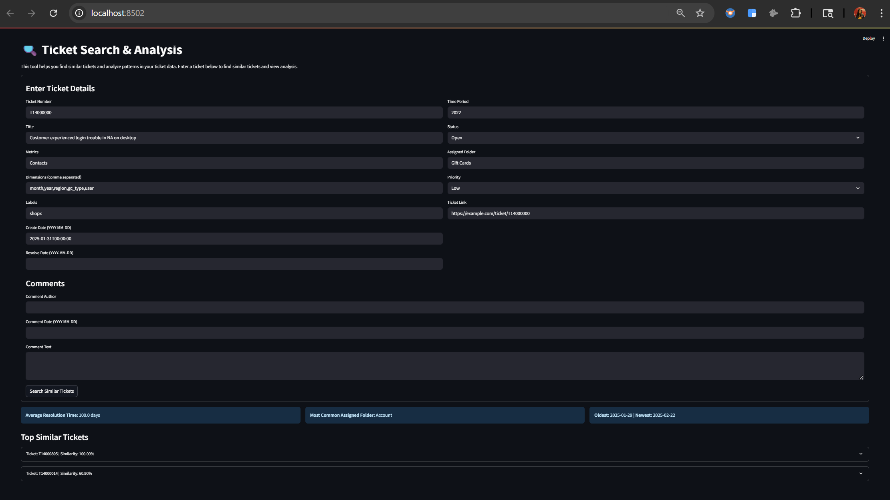

# 🎫 Ticket Search & Analysis

This project is a machine learning-powered tool for **semantic ticket retrieval** and **workload analysis**. Inspired by real-world enterprise workflows, it simulates how analysts can reduce manual effort by automatically surfacing relevant historical support tickets.



## ✨ Features

* 🔍 **Semantic Ticket Search:** Embedding-based retrieval and reranking to identify similar tickets
* 📊 **Similarity Scoring:** Includes normalized similarity scores
* 📊 **Resolution Insights:**
  * Average resolution time
  * Most common assigned team/folder
  * Ticket creation date range
* 🖥️ **Interactive UI:** Streamlit app for live ticket query exploration

## ⚠️ Disclaimer

* This project uses **100% synthetic data**. No confidential or internal company data has been used.
* The structure mirrors enterprise ticketing systems, designed for **portfolio demonstration** only.
* The models used (e.g., all-mpnet-base-v2, CrossEncoder) are open-source and not tied to any internal tooling.

## 🔧 Technologies Used

This project combines NLP and vector search to deliver fast and relevant ticket recommendations.

* **FAISS (Facebook AI Similarity Search):** Used for high-speed approximate nearest neighbor search over ticket embeddings. Enables scalable similarity matching across thousands of historical tickets.
* **all-mpnet-base-v2 from sentence-transformers:** A pretrained transformer model fine-tuned for sentence-level semantic similarity. Converts ticket titles and comments into dense vector embeddings for comparison.
* **CrossEncoder (MiniLM or similar):** A reranker model that re-evaluates top candidate pairs for finer semantic matching, improving precision over raw FAISS results.
* **Streamlit:** Lightweight frontend used for exploring the ticket search and similarity insights interactively.
* **Python, NumPy, pandas, scikit-learn:** Core libraries used for data handling, evaluation, and pipeline orchestration.

## 🧠 How It Works

Like recommendation systems, this project follows a typical ML system design pipeline: data ingestion → candidate generation → reranking. Each phase plays a role in progressively narrowing down relevant tickets with higher semantic precision.

### 1. Data Generation

* Uses a synthetic JSON dataset simulating 1000+ tickets.
* Includes manually-labeled "similar tickets" in comments to train the reranker.
* Labels are generated based on the following logic:

  * If the candidate ticket is referenced in the query's comments as a similar ticket → **label = 1**
  * Else, label = 1 only if:

    * The `assigned_folder` matches
    * The `metrics` match
    * At least one `dimension` overlaps
  * If none of the above apply → **label = 0**

### 2. Retrieval Phase

* Ticket embeddings are generated using a SentenceTransformer model (e.g., all-mpnet-basev2).
* FAISS is used to perform approximate nearest-neighbor search and retrieve the top candidate tickets.
* **Evaluation:** Recall\@10 is used to measure how often relevant tickets are present in the top-K results retrieved by FAISS. Text is embedded using sentence-transformers (e.g., all-mpnet-base-v2). Cosine similarity is used to identify the most similar tickets by normalizing the embeddings and using the `IndexFlatIP` index in FAISS, which supports efficient inner product search equivalent to cosine similarity on normalized vectors.

### 3. Reranking Phase

* Trained using pairs of \[query, candidate] with binary similarity labels.
* A fine-tuned CrossEncoder model reranks the retrieved candidates for improved accuracy.
* **Evaluation:** Precision\@3 is used to evaluate how many of the top-K reranked results are truly relevant, based on manually labeled or heuristically derived similar tickets.

### 4. Streamlit App

* Allows users to interactively run semantic search over the ticket corpus.
* Returns up to 3 results. If ticket scores vary significantly (e.g., 100, 60, and 0), results with a final similarity score below 40 are omitted to ensure result quality and clarity for the end user.

## 📁 Codebase Overview

### Main Scripts

* `app.py`: Streamlit UI
* `inference.py`: Core inference logic. This script takes a new query ticket, embeds it using the same transformer model, searches the FAISS index for top similar historical tickets, and optionally reranks them using the fine-tuned CrossEncoder model for improved resolution suggestion quality.
* `rank/rerank_model.py`: Load reranker
* `rank/rerank_trainer.py`: Train reranker
* `evaluate_ranking.py`: Evaluate reranker precision\@K
* `evaluate_search.py`: Evaluate FAISS recall\@K
* `prepare_data.py`: Generate embeddings, FAISS index
* `generate_training_data.py`: Build reranker training pairs

### Directory Structure

```
ticket-search/
│
├── artifacts/                 # FAISS index and embedding matrix
│   ├── embedding_matrix.npy
│   ├── faiss.index
│   └── ticket_ids.json
│
├── data/                      # Synthetic dataset
│   ├── raw_data.json
│   ├── rerank_train.json
│   └── rerank_test.json
│
├── rank/                      # Training scripts for reranker
│   ├── rerank_model.py
│   ├── rerank_trainer.py
│   └── precision.py
│
├── rank_model/                # Trained CrossEncoder model artifacts
│   ├── config.json
│   ├── model.safetensors
│   ├── tokenizer.json
│   └── vocab.txt
│
├── search/                    # FAISS-based retrieval system
│   ├── faiss_index.py
│   ├── candidate_generator.py
│   └── recall.py
│
├── utils/                     # Helper utilities
│   ├── helpers.py
│   ├── io.py
│   └── text_builder.py
│
├── app.py                     # Streamlit app interface
├── inference.py               # Inference module
├── evaluate_ranking.py        # Evaluate precision@k
├── evaluate_search.py         # Evaluate recall@k
├── generate_training_data.py  # Generate rerank dataset
├── prepare_data.py            # Embedding and ticket prep
├── train_reranker.py          # Main reranker training script
├── requirements.txt
└── README.md
```

## 📄 Sample Ticket Format

Each ticket in the dataset is represented as a JSON object with the following structure:

```json
{
  "ticket_number": "T14000000",
  "title": "Customer experienced login trouble in NA on desktop",
  "metrics": "Contacts",
  "dimensions": [
    "month",
    "year",
    "region",
    "gc_type",
    "user"
  ],
  "time_period": "2022",
  "status": "Resolved",
  "assigned_folder": "Gift Cards",
  "labels": "shopx",
  "priority": "Low",
  "create_date": "2025-01-31T00:00:00",
  "resolve_date": "2025-05-15T00:00:00",
  "link": "https://example.com/ticket/T14000000",
  "comments": [
    {
      "author": "John Doe",
      "date": "2025-01-31T00:00:00",
      "comment": "Similar tickets - https://example.com/ticket/T14000805, https://example.com/ticket/T14000014, https://example.com/ticket/T14000969"
    }
  ]
}
```

## ⚙️ Setup

Before training or running inference, set up your Python environment and install dependencies.

1. Create a virtual environment

```bash
python -m venv venv
source venv/bin/activate  # On Windows: venv\Scripts\activate
```

2. Install required packages

```bash
pip install -r requirements.txt
```

3. Download or prepare your dataset

Ensure `data/raw_data.json` exists. The synthetic dataset has been hidden for safety purpose. You can build your own ticket data with the same schema.

## 🏋️‍♀️ Training

For retrieval-based search, no model training is required. You simply need to prepare the ticket data and run the similarity lookup.

Below is the input format per ticket format to the embedding model:

```python
f"Ticket Summary: {row['title']}. "
  f"Focus Metric: {row['metrics']}. "
  f"Breakdowns: {', '.join(row['dimensions'])}. "
  f"Folder: {row['assigned_folder']}. Label: {row['labels']}. Time: {row['time_period']}."
```

This text is fed into the embedding model to capture ticket semantics in a structured natural language form. Run the following command to generate this text and add to the data:

```bash
python prepare_data.py
```

To evaluate the retrieval quality (Recall\@K), run:

```bash
python evaluate_search.py
```
This script uses the SentenceTransformer model to generate dense vector embeddings for all tickets, then builds a FAISS index for fast similarity search using scripts from the `search/` module (`faiss_index.py`, `candidate_generator.py`, `recall.py`). It saves the index, embeddings, and ticket IDs into the `artifacts/` directory for reuse across evaluation and inference steps.

You can make changes to the model or distance metrics through scripts from the `search/` module.

You can then proceed to train the CrossEncoder reranker using either the default labeled data or your own ticket dataset.

### Steps:

1. Generate reranker training and test data:

The `generate_training_data.py` script creates binary-labeled training examples for the reranker. It uses the FAISS index to find the top 10 candidates for each ticket and labels each candidate as similar (1) or not (0) based on:

* Whether the ticket was mentioned in the original ticket's comment as similar
* Fallback heuristics (folder match, metric match, shared dimensions)

The script also performs a train-test split on the query IDs to ensure all query - candidate pairs for one query IDs is in either train/test to avoid leakage.

```bash
python generate_training_data.py
```

2. Train the reranker model:

Run the below code to train the model. This ustilizes scripts from `rank/` folder. The `rerank_model.py` allows you to change the model and its parameters and `rerank_trainer.py` allows you to change training specifications. Pretrained model artifacts will be saved in the `rerank_model/` directory.

```bash
python train_reranker.py
```

3. Evaluate reranker precision after training

This script compares the reranked ticket results against ground-truth labels to measure how accurately the CrossEncoder model brings the most relevant tickets to the top. It computes Precision@K to quantify the reranker's effectiveness.

```bash
python evaluate_ranking.py
```

## 📊 Evaluation

* **Precision\@3** – Out of all reranked tickets how many are relevant (this system achieved 70% precision in evaluation)
* **Recall\@10** – Out of all relevant tickets how many are retrieved (this system achieved 93.4% recall in evaluation)

## 🚀 Final Run / Inference

The `inference.py` script can be used to search for similar tickets to a new query ticket during final evaluation or as a standalone utility. It performs the following steps:

1. Loads the trained FAISS index and ticket embeddings from the `artifacts/` directory.
2. Embeds the new query using the same SentenceTransformer used in training.
3. Searches for the top-K most similar tickets using cosine similarity (via normalized vectors and FAISS `IndexFlatIP`).
4. Reranks results using the fine-tuned CrossEncoder model for better semantic relevance.

To evaluate the whole pipeline uncomment the below code in `inference.py`:

```python
# --- test code for standalone use ---
# if __name__ == "__main__":
#     # Example ticket for testing
#     input_json = input("Paste your query ticket JSON:")
#     # Take user input as JSON
#     query_ticket = json.loads(input_json)
#     results = find_similar_tickets(query_ticket, top_k=3)
```

This allows you to pass in a custom ticket and retrieve top-3 similar results for evaluation or validation purposes. To run inference from the command line:

```bash
python inference.py
```

### To run inference and streamlit app:

Comment the block at the bottom of `inference.py`:

```python
# --- test code for standalone use ---
# if __name__ == "__main__":
#     input_json = input("Paste your query ticket JSON:
")
#     query_ticket = json.loads(input_json)
#     results = find_similar_tickets(query_ticket, top_k=3)
```

Then run:

```bash
streamlit run app.py
```

This will prompt you to input a ticket. The script will return the top-3 most similar tickets based on semantic similarity. See screenshots below.


# 🔮 Possible Enhancements

1. LLM Integration: Plug in a LLaMA or GPT-based model to generate fluent, context-aware draft responses using retrieved tickets as grounding context.

2. Contextual Prompt Design: Feed top-k retrieved tickets along with the query into the prompt to let the LLM generate resolution summaries.

3. Response Ranking: Use LLMs to rank or score generated responses based on relevance and helpfulness.

4. User Feedback Loop: Capture analyst feedback to improve LLM outputs through few-shot updates or prompt tuning.

## 👩‍💻 Author

**Shraddha Gupte**
*Data Scientist | Machine Learning | NLP | LLM | Product Strategy*
🔗 [LinkedIn](https://www.linkedin.com/in/shraddha-gupte/) | 🌐 [GitHub](https://github.com/ShraddhaGupte97)
